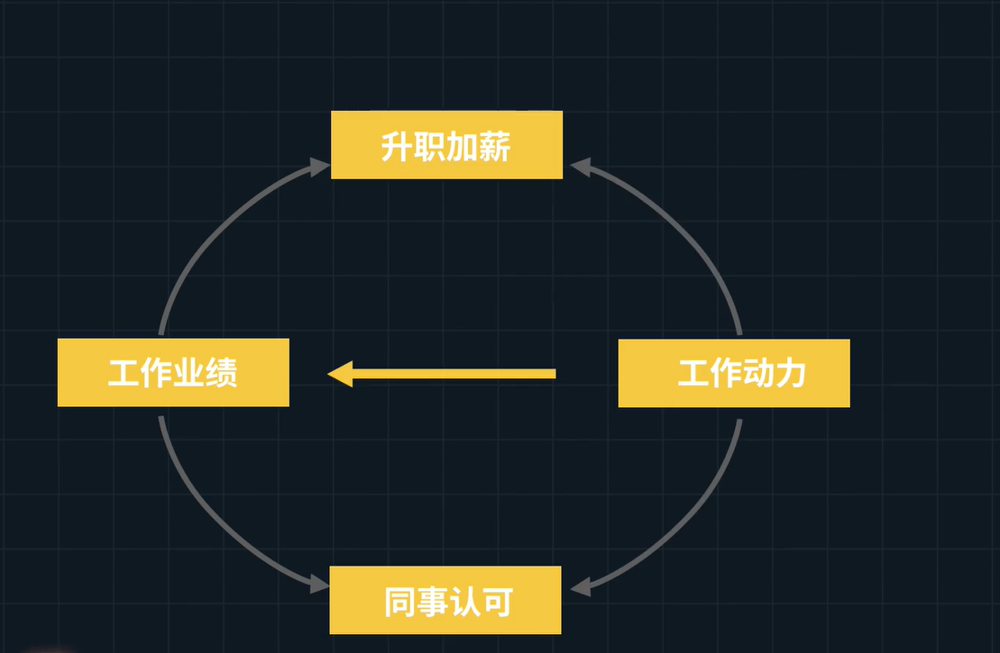

# 学科1：熵与热力学重要模型

## 熵的公式

$$
S = k\times \ln W
$$

上式中：S表示熵，W代表微状态常数，总结为如下式子：
$$
S\propto(正比)  W
$$

## 熵在热力学中的性质

* 熵更小代表着有序，状态数更少，越有序，概率越小
* 熵更大代表着乱，状态数更多，混乱无序，概率越大

总结为：状态数更少熵更小，熵更大那么更乱随之而来的状态数更多

【例子1】

将6块砖从高处往下扔，最有可能出现哪种状态呢？

我们可以看到，左边的只有一种状态，它出现的概率很小。而右边的图存在着N种可能，所以出现的概率会更大。从这个小例子中我们又总结出了关于**生活中的例子**：

1. 如果随波逐流，一个普通人得人生更太可能是混乱得而不是有序的
2. 如果你想做出点与众不同的事情，你更有可能会遭受失败而不是成功

【例子2】

为什么挺直腰板可以集中注意力？

因为当我们挺直腰板的时候，只有一种状态，而当我们驼背的时候会有N中情况，会让自己更加放松，更加无序。从这个例子中，我们又能得到如下结论：

* 在这个世界上，混乱才是常态，有序是需要刻意营造的

## 封闭系统中熵减的办法

在封闭系统中，熵会随着时间的推移而增加，即变得更加的无序

如上图，我们在两个封闭的系统中间，我们加一个小人进行选择性判断：如果分子的箭头朝右，则能让左边的分子向右边扩散。这样的好处使两个封闭的系统混在一起而非更加的混论，而是呈现出一种有序状态。这种过程需要两点：**感知**和**选择**，同时这两点具有以下性值：

* 感知和选择能使事物更加有序

* 感知和选择需要能量和信息的

### 作为一个人如何熵减

如果我们按照上图的流程进行自我调整，那么我们会减少熵增，减少不确定性，使生活更加规律。（负信息：撒谎或者传谣言、胡思乱想）

如下图则是我们在生活中如何通过自己的感知进行选择，使熵更小化

# 学科2：系统论重要模型

##  良性飞轮

* 工作中的良心飞轮

* B站良性飞轮

  

* 淘宝良性飞轮

  

良性飞轮能事倍功半

恶行飞轮能事半功倍

## 系统

很多实体通过相互联系，形成一个有规律的整体

* 生物系统

  番茄，鸽子

* 社会系统

  公司国家

* 机械系统

  汽车，飞机，手机

* 生态系统

  森立，海洋

每个系统有三个组件

* 要素

  * 正要素
    * 正信息（让这个世界减少不确定性）
    * 正能量
    * 资产
  * 负要素
    * 负信息（让这个世界变得更混乱的信息）
    * 负能量
    * 负债

* 关系

  * 正关系：加强关系
  * 负关系：减弱关系

* 作用

  * 快作用

    你做一件事情，立马得到反馈

  * 慢作用

    需要滞后很长时间才会有成果

五种系统现象

* 良性循环

  正要素和正关系组合

  

   

* 恶行循环

  负要素和正关系组合

  

* 贤者时刻

  负要素和负关系组合

  

* 回归平庸

  正要素和负关系组合

  

  你想改变现状的时候，需要抛弃过去的成绩。而你过去的成绩越好，你可能就越不太可能改变现状

* 滞后效应

  生活就像一个有时间滞后的热水器去洗澡

  

  人生就像是洗热水澡，而我们大多时候都不知道有时间滞后。当我们想调道合适的温度洗澡的时候，需要不断的来回调节热水器开关。

### 如何找到生活的恶性循环

需要用到因果分析法，不断的追问自己为什么

* 做事很低效

  

### 如何破解恶行循环

杠杆解，命门，胜负手，关键变量。

如上面的做事很低效，我们应该从最终原因出发

### 建立仪式

仪式是一种固定的，自动执行的动作组合。在执行的时候不需要思考任何东西，只要开始做第一个动作，惯性会让你将后面动作自动完成。

比如：刷牙，当我们拿起牙刷走进浴室的那一刻，我们大脑不需要做任何思考，我们会按照本能将刷牙这个动作一气呵成。

### 如何建立良性循环

任何一个良性循环都是从小事做起，比如说：每天坚持锻炼，我们不求多，每天之锻炼2分钟。随着这个良性循环的建立，我们可以适当的提高量，将锻炼2分钟提升至10分钟等等。因为自己做了一个承诺，并且兑现了这个承诺，每次兑现这个承诺的时候会对自己建立一个信任。从而建立起了一个良性循环

在工作中，如何从小的良性循环开始建立呢？

通常第一步，我们不要做太多的承诺，但只要我做出的承诺，就必须实现，及比如守时

### 不可能三角

在公司或者学校，你只能取其中两样

### 储蓄池

如果这个值跌破了你的容忍阈值，那么你就会放弃

通过如下方式提升自身储蓄池道得容量

我们通常放弃，是因为我们在波谷的地方无法忍受，储蓄池就相当于一个缓冲地带，提高你的耐受程度。当你处于人生低谷的时候，由于储蓄池的存在，会让你不至于破防了你忍受底线

### 鲁棒性，适应力

在异常，危险环境下系统的生存能力。比如计算机在输入错误，磁盘故障，网络攻击或有意为之的情况下，能否不死机，这就是它的鲁棒性

#### 模拟攻击

为了提高鲁棒性，提高自己生活的适应力。我们需要不断的让自己受点小伤，留时间让伤口恢复，循环反复来测试自己的系统。另一种说法就是**跳出舒适权**

如：看一看有深度的课外书籍，少看公众号和抖音。经历一下小幅度的社会性死亡。打一些平时很少玩的游戏类型。看自己平时不感冒的电影。出去旅游接触陌生人或者事

### 自组织

我们的身体是一个自运转的系统，很多的行为根本就是自动自发，不受控制的。所以关键就是我们要管理输入变量的因，而不要太执着于输出变量的那个果

### 层次性

一个大的系统，是由多个子系统组成，而子系统又由很多个孙系统组成。我们应该努力把生活中的那些大事拆分成很多小事情，然后进行封装。你封装的模块越多，那么你生活中能用到的行为模式就越多。